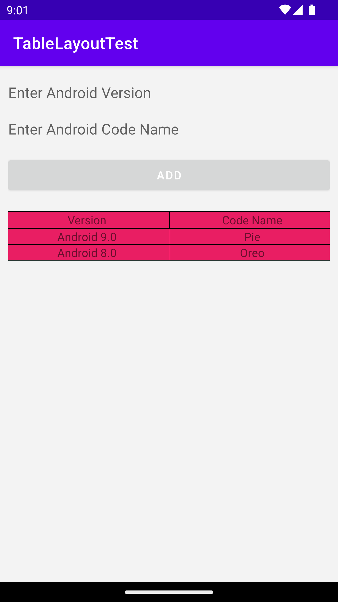
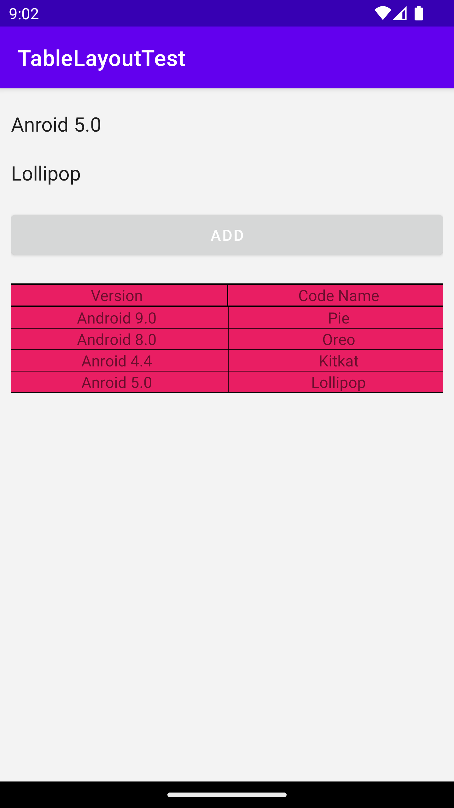

    <h2 align="center">Screenshots</h2>

<h3>TableLayout</h3>
<table align="center" border="0">
    <tr>
        <td></td>
        <td></td>
        <td></td>
    </tr>
</table>
<h3>MyStoreApp</h3>
<table align="center" border="0">
    <tr>
        <td></td>
        <td></td>
    </tr>
</table>

