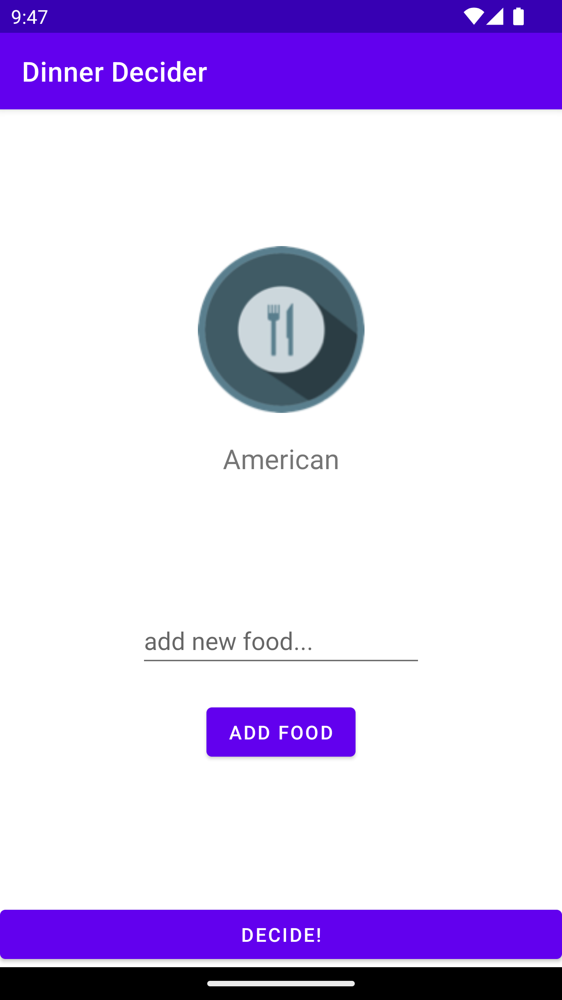
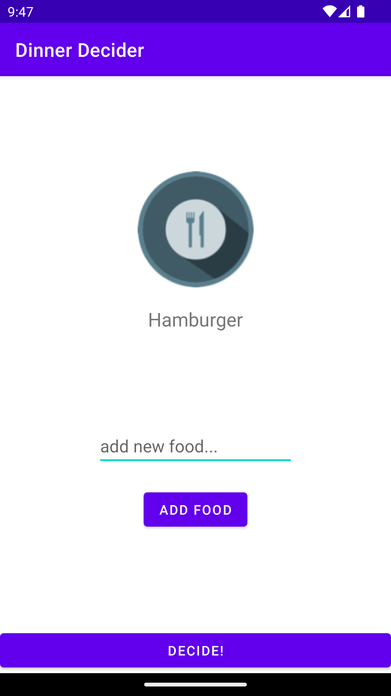
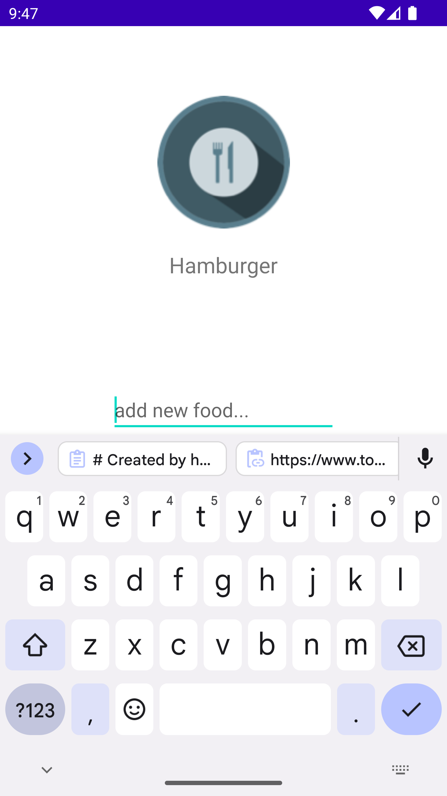
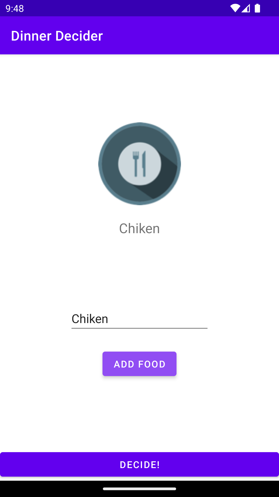

    <h2 align="center"> CS473-MDP - Mobile Device Programming </h2>

    <h2 align="center">Screenshots</h2>

<h2>Assignment 2</h2>

<table align="center" border="0">
    <tr>
        <td></td>
        <td></td>
        <td></td>
        <td></td>
    </tr>
</table>

